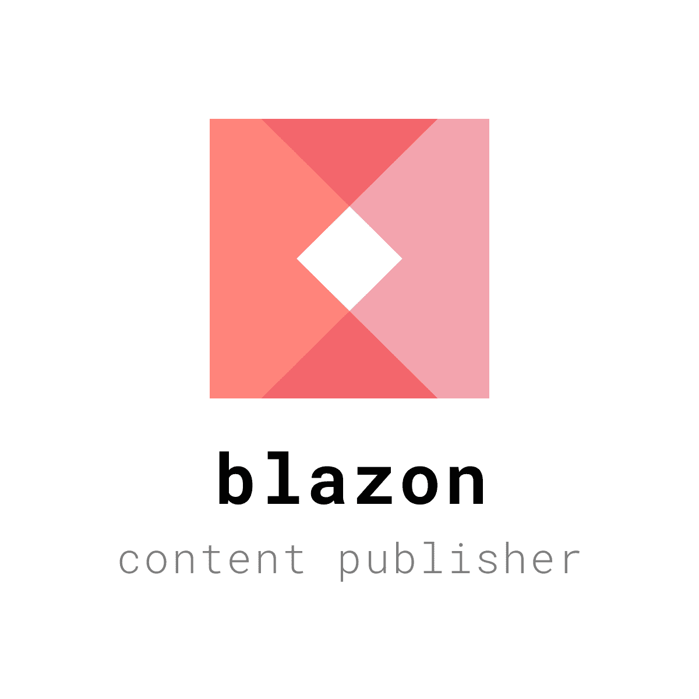

Blazon
======

Blazon is a data-driven, plugin-powered, multi-target content publishing framework.

## Use-cases:

* Documentation, guides, manuals
* Contracts (with variables)
* Legal documents
* "Conditional text" content
* Wiki content rendering
* Marketing sites
* Policies, Procedures, Forms
* Knowledge graphs
* Digital gardens
* Code repository project documentation
* Complex data graph visualization (i.e. organizational structures)

## Definitions:

* Publication: Collection of "documents"
* Document: unique identifier (path), and a controller for rendering output
* Plugin: allows to modify every phase of the loading and publishing process
* Target: one of many outputs, produced by a Publisher (i.e. static html, pdf, etc).

## Features:

* Load content from local or remote sources
* Markdown, with frontmatter
* Xillion Resources
* Twig templating
* Supports both static site generation and dynamic rendering

## Examples

* https://github.com/linkorb/starwars-blazon graphql + twig example site

## Inspiration

* Gatsby
* Hugo
* Sage
* Xillion
* Schemata

## License

MIT. Please refer to the [license file](LICENSE.md) for details.

## Brought to you by the LinkORB Engineering team

 
Check out our other projects at [linkorb.com/engineering](http://www.linkorb.com/engineering).

Btw, we're hiring!
